$$
% Custom Functions
\gdef\c#1{\mathcal{#1}}
\gdef\bf#1{\mathbf{#1}}
\gdef\bb#1{\mathbb{#1}}
$$

<!-- _paginate: false -->

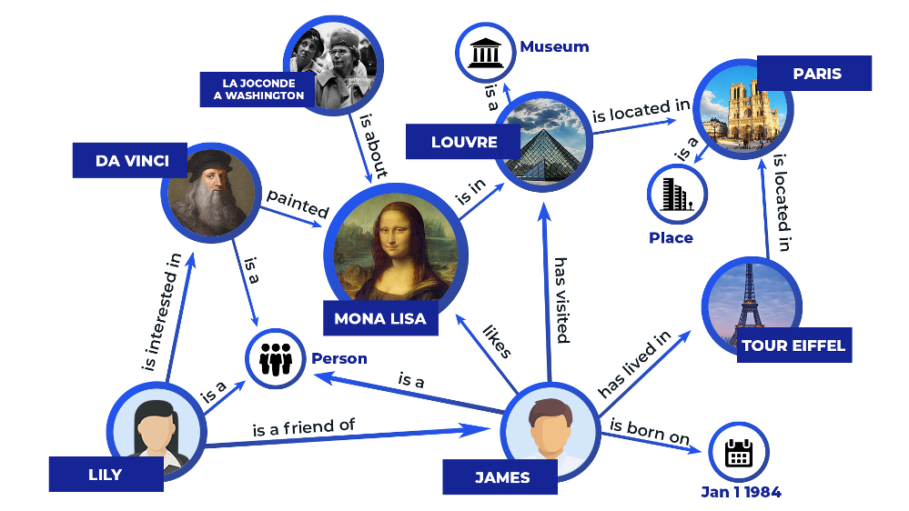

# *Knowledge Graph Embeddings*

## Apprendimento Automatico
### A.A. 2024-2025

 

Docente: 	**Nicola Fanizzi**
Speaker:    **Ivan Diliso**

 

> Dipartimento di Informatica 
> Università Degli Studi di Bari Aldo Moro

<!-- _footer: ""-->
---
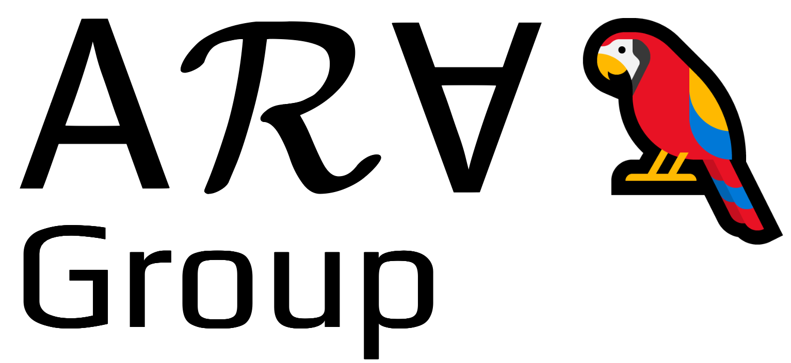

# Chi sono?
### **Ivan Diliso**
Dottorando in Informatica e Matematica del gruppo di ricerca *ARA* (Apprendimento e Ragionamento Automatico).
# Di cosa mi occupo?
Knowledge Graph Embedding, Neuro-Symbolic AI, Ontologies and Ontology Injection

---

# **Indice** dei contenuti

1. Cosa è un *Knowledge Graph*
2. *Machine Learning* su Knowledge Graphs
3. Strategie di *Valutazione* e Metriche
4. Argomenti Avanzati
    - Calibrazione
    - Ragionamento Neuro-Simbolico
    - Spazi di rappresentazione oltre l'euclideo

---
<!-- header: Knowledge Graphs -->

# **Definizioni** Fondamentali

Un *Knowledge Graph* è una rappresentazione strutturata di conoscenza tramite nodi (*entità*) e archi (*relazioni*) per collegare e integrare informazioni.

---

# **Definizioni** Fondamentali

Sui dati, possiamo fare due tipi di assunzioni fondamentali:
- *Closed* World Assumption (CWA): Assenza di un fatto, significa che è falso
- *Open* World Assumption (OWA): Assenza di un fatto, significa solo che non è conosciuto

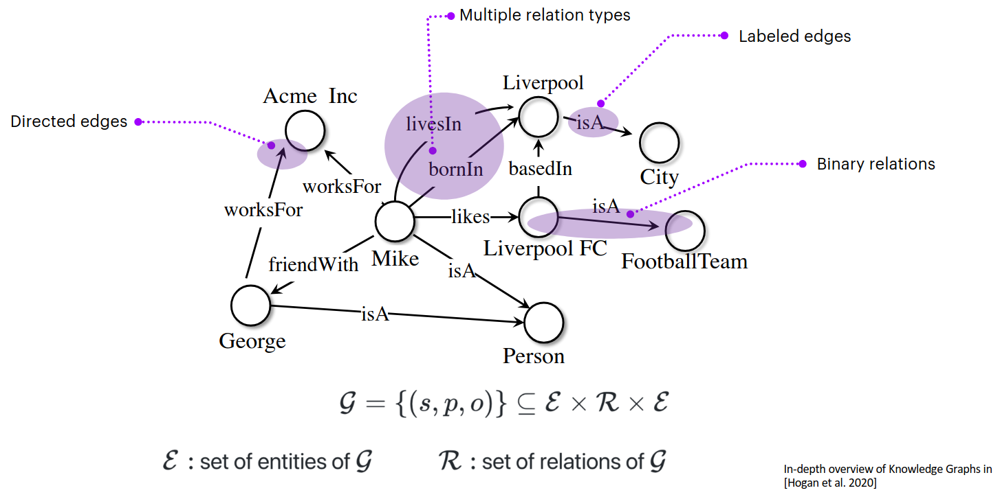

---

# **Definizioni** Fondamentali

Questo tipo di dati si presenta sottoforma di *triple*, nella forma $<s,p,o>$, ad esempio, potremmo avere:

$$<Mario, friendOf, Luigi>$$

Quando parlerò di **soggeto** della tripla, mi sto riferendo alla entità in testa alla tripla (eg. Mario), con **oggetto** mi riferisco invece alla entità in coda alla tripla (eg. Luigi)

---

<!-- header: Machine Learning su Knowledge Graphs -->
# **Machine Learning** su Knowledge Graphs

Problemi risolvibili:
- Link Prediction
- Triple Classification
- Graph Classification
- Community Detection
- Anomaly Detection
- Entity Matching
- ...

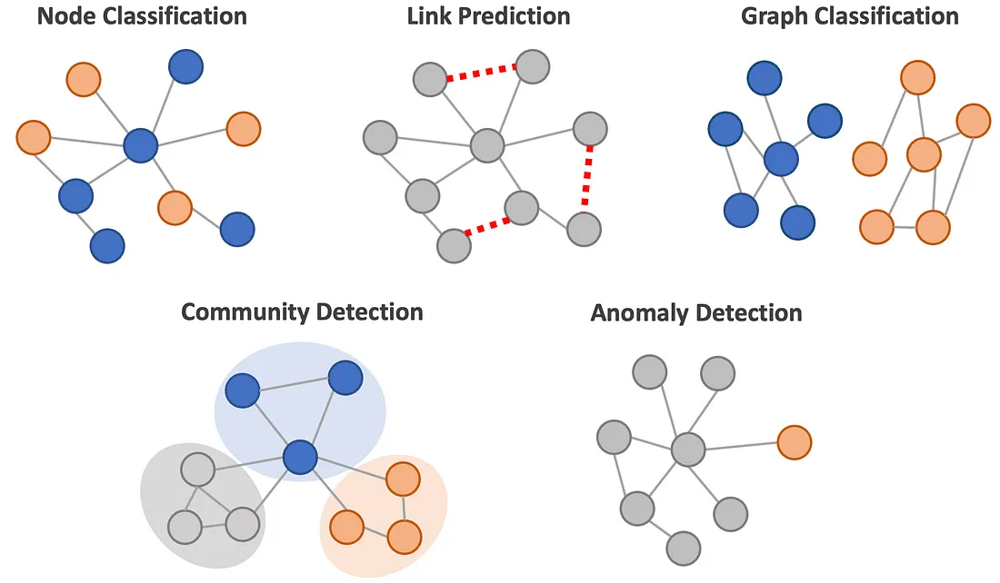

---

# Metodi Tradizionali (**Shallow**)

Nell'ambito dello **"Statistical Relational Learning"** diversi approcci tradizionali sono stati sviluppati:

- **Logic Programming**
- **Inductive Logic Programming** (ILP)
- **Rule Mining**: AMIE
- **Graphical Models** Conditional Random Fields, Modelli Relazionali Probabilistico, Reti di Markov, Reti di dipendenza, etc etc

## Limitazioni

Scalabilità, debole potere di modellazione, approcci non differenziabili

---

# Metodi Tradizionali (**Deep**)

- Le **CNN** lavorano naturalmente su "griglie", quali immagini
- Le **RNN** lavorano su sequenze, quali testo 

Abbiamo la necessità di gestire la *complessità* dei grafi:

- Assenza di **spatial locality**
- Assenza di un **ordinamento dei nodi** fisso
- Naturalmente **multimodali**, concetti, testi, numeri, date, immagini

---

# Apprendimento su *Grafi* come **Encoder** -**Decoder**

- Nei modelli che vedremo, il decoder prenderà la forma di una *lookup table*

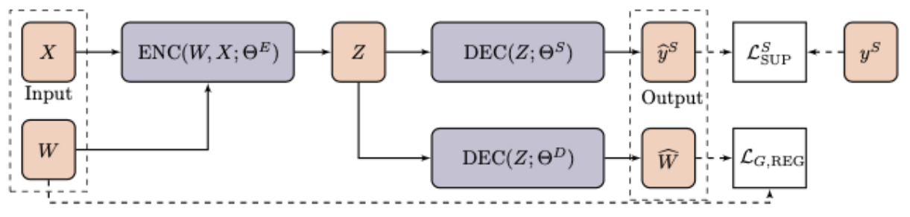

---
<!-- header: Apprendere le Rappresentazioni di Nodi e Relazioni -->
# Apprendere le **Rappresentazioni** di Nodi e Relazioni

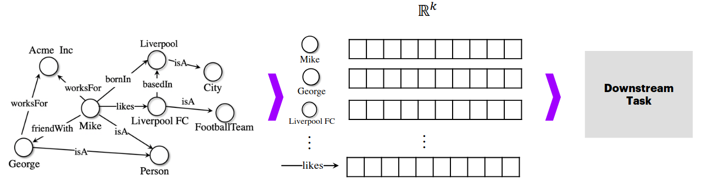

Metodologie basate sull'apprendimento automatico di *rappresentazioni vettoriali* di nodi e relazioni. Proiettiamo la conoscenza *simbolica* su uno spazio vettoriale continuo.

---

### Da **nodi** e **relazioni**...

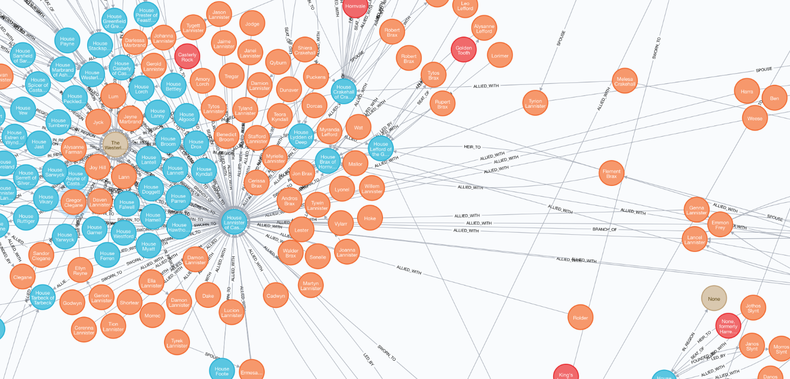

---

### a rappresentazioni **vettoriali**!

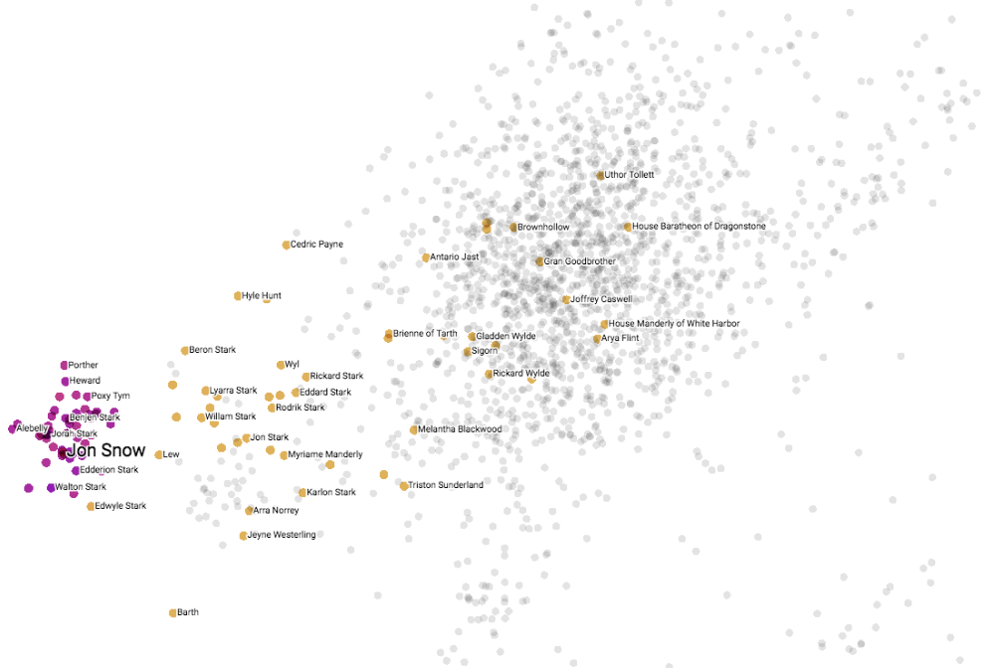

---

# **Modelli** in Letteratura

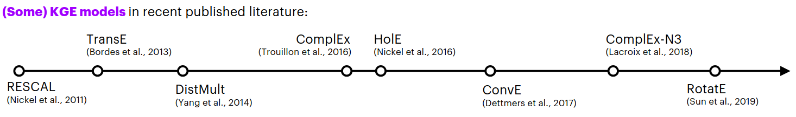

In letteratura troviamo varie tipologie di modelli, che si possono categorizzare sulla base della tipologia di apprendimento, *translational*, *factorization*, *neural*, etc etc

---
<!-- header: Anatomia di un modello di KGE -->
# **Anatomia** di un modello di KGE

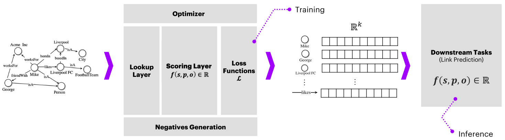

- Funzione di **score** delle triple $f(t)$
- Funzione di **loss** $\mathcal{L}$
- Algoritmo di **ottimizzazione**
- Strategia di generazione dei **negativi**

---
# Funzione di **score** delle triple
La funzione $f$ assegna uno score ad una tripla $<s,p,o>$. La strategia di scoring varia in base alla metodologia scelta ad esempio:

## **Traslation** Based

### *TransE*
$$
f_{TransE}(\langle s,p,o \rangle) = - \|(e_h - r_p) - e_t \|
$$

### *RotatE*

$$
f_{RotatE}(\langle s,p,o \rangle) = - \|e_s \circ r_p - e_o \|_n
$$

---

## **Traslation** - Esempio grafico

 

TransE
  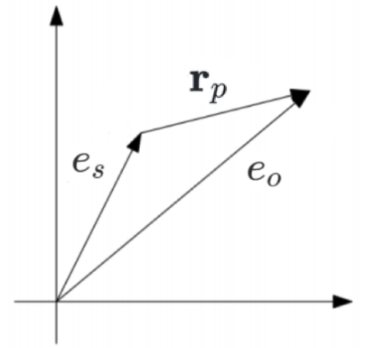
  RotatE
  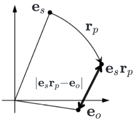

---

## **Factorization** Based
*RESCAL*

$$
f_{RESCAL}(\langle s,p,o \rangle) = e_s^\top W_r e_o
$$ 

## **Convolution** Based
*ConvE*

$$
f_{ConvE}(\langle s,p,o \rangle) =  f(vec(f([\overline{e_s};\overline{r_p}]*\omega))\mathbf{W}) e_o
$$
 

con $f$ funzione non lineare, $*$ operatore di convoluzione e $\overline{x}$ un reshape 2D del vettore.

---

# **Complessità** e **Proprietà** dei KGE

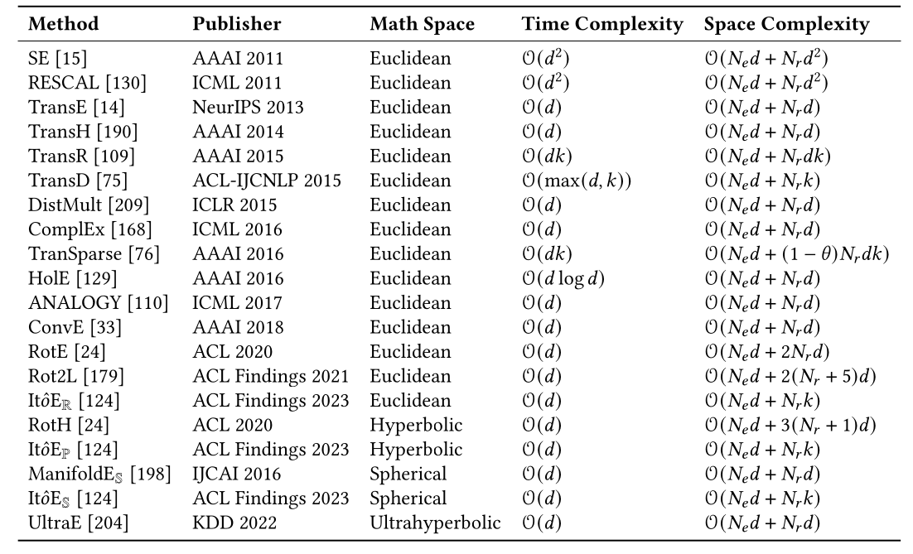

Modelli si differenziano nel tipo di *spazio* utilizzato (vedremo più avanti), funzione di scoring, complessita nello spazio e nel tempo e tipo di *proprietà che possono modellare*

--- 

# **Complessità** e **Proprietà** dei KGE

- Simmetria `<Alice, marriedTo, Bob>`
- Asimmetria`<Alice, childOf, Jack>`
- Inversione `<Alice,childOf,Jack>`, `<Jack,fatherOf, Alice>`
- Composizione  `<Alice, childOf, Jack>`,`<Jack, siblingOf, Mary>`,
`<Alice, nieceOf, Mary>`

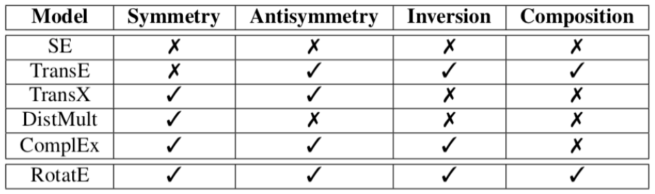

---

# Funzione di **loss** $\mathcal{L}$

Varie funzioni di loss provenienti dagli ambiti del machine learning e information retrieval (**basate su ranking**)

*Pairwise Margin-Based Hinge Loss*

$$
\mathcal{L}(\Theta) = \sum_{t^+\in \mathcal{G}}\sum_{t^-\in \mathcal{C}} \max(0,[\gamma+f(t^-;\Theta)-f(t^+;\Theta)])
$$ 

*Negative Log-Likelihood / Cross Entropy*

$$
\mathcal{L}(\Theta) = \sum_{t\in \mathcal{G} \cup \mathcal{C}} \log(1 + \exp(-y f(t;\Theta)))
$$ 

$y \in \{-1,+1\}$ label della tripla $t$

---

# Ulteriori funzioni di **loss**

*Binary Cross-Entropy*

$$\c{L}(\Theta) = -\frac{1}{N}\sum^N_{t \in \c{G}\cup\c{C}} y\log(\sigma(f(t;\Theta))) + (1-y)\log(1-f(t;\Theta))$$

 

*Self-Adversarial*

$$\c{L}(\Theta) = -\log \sigma(\gamma+f(t^+;\Theta)) - \sum^N_{t \in \c{G}} p(t^-;\Theta) \log\sigma(-f(t^-;\Theta)-\gamma)$$

$p(t^-;\Theta)$ peso del negativo $t$

---
# Strategia di generazione dei **negativi**
Prende anche il nome di **negative sampling**. 

Come possiamo generare negativi (fatti falsi)? 

*Local Closed World Assumption*: Un KG è solo localmente completo

Andiamo a **corrompere** le triple creando dei negativi sintetici:

$$
\c{C} = \{\langle\hat{s},p,o\rangle \mid \hat{s} \in \c{E} \} \cup \{\langle s,p,\hat{o}\rangle \mid \hat{o} \in \c{E} \}
$$

---
## Esempio di negative sampling

$\c{E} = \{\texttt{Mike}, \texttt{Liverpool}, \texttt{AcmeInc}, \texttt{George}, \texttt{LiverpoolFC}\}$

$\c{R} = \{\texttt{bornIn}, \texttt{friendWith}\}$

 

$t \in \c{G} = \langle\texttt{Mike bornIn Liverpool}\rangle$

$$
\mathcal{C}_t = \left\{
\begin{array}{l} % Defines one left-aligned column
  \langle\texttt{Mike} \quad \texttt{bornIn} \quad{ \color{purple}\texttt{AcmeInc}} \rangle,\\
  \langle\texttt{Mike} \quad \texttt{bornIn} \quad \texttt{ \color{purple}LiverpoolFC}\rangle,\\
  \langle\texttt{ \color{purple}George} \quad \texttt{bornIn} \quad \texttt{Liverpool}\rangle,\\
  \langle\texttt{ \color{purple}AcmeInc} \quad \texttt{bornIn} \quad \texttt{Liverpool}\rangle
\end{array}
\right\}
$$

---
# Altri **dettagli supplementari**

- *Ottimizzazione*: Qualsiasi algoritmo che avete già studiato nel corso, SGD, ADAM, etc

- *Inizializzazione*: Il processo deve partire da embedding iniziali, si possono utilizzare funzioni quali la distribzuione **unioforme**, **normale** o **xavier**

- *Regolarizzazione*: L1,L2, Dropout, Vincoli di **Norma**

--- 
<!-- header: Valutazione e Metriche -->
# **Valutazione** e Metriche

Nella link prediction impariamo uno score proporzionale alla probabilità che la tripla sia vera, in altre parole stiamo imparando un task di *ranking* delle triple.

Possiamo prendere "in prestito" le metriche di valutazione dell'*information retrieval*. Non abbiamo una bisogno di una **ground truth** nella valutazione del test set. Rispondiamo alla domanda:

### "Quanto in alto vengono **classificate** le triple positive rispetto alle triple negative generate artificialmente?"

---

### ⁉ In **media**, che **rank** viene assegnato alla tripla vera rispetto ai negativi sintetici?
 

*Mean Rank* (MR)

$$\displaystyle MR=\frac{1}{|Q|}\sum_{i=1}^{|Q|} rank(\langle s,p,o\rangle_i)$$

*Mean Reciprocal Rank* (MRR)

$$\displaystyle MRR = \frac{1}{|Q|}\sum_{i=1}^{|Q|} \dfrac{1}{rank(\langle s,p,o\rangle_i)}$$

---

### ⁉ Quante volte la tripla vera è stata posizionata almeno nelle **prime $N$ posizioni**?

 

*Hits@N*

$$Hits@N = \sum_{i=1}^{|Q|} \mathbb{1}(rank(\langle s,p,o\rangle_i) \leq N)$$

---

# Esempio

| s | p | o |score|rank|
|:-:|:-:|:-:|-:|-:
|`Mike`|`bornIn`|`Leeds`|0.78|1|
|`Mike`|`bornIn`|`Italy`|0.75|*2*|
|`Mike`|`bornIn`|`Germany`|0.69|3|
|`George`|`bornIn`|`Italy`|0.45|4|
|`Mike`|`bornIn`|`George`|0.23|5|

| s | p | o |score|rank|
|:-:|:-:|:-:|-:|-:
|`Mike`|`friendWith`|`George`|0.90|*1*|
|`Mike`|`friendWith`|`Jim`|0.34|2|
|`Acme`|`friendWith`|`George`|0.29|3|
|`Mike`|`friendWith`|`Italy`|0.20|4|
|`France`|`friendWith`|`George`|0.15|5|

$MR = 1.5\qquad MRR = .75 \quad Hits@1 = .5\qquad Hits@3 = 1.0$

---
<!-- header: Argomenti Avanzati -->

# Argomenti **Avanzati**: 

 

1. *Calibrazione*
2. KGE & Ragionamento *Neuro-Simbolico*
3. *Spazi* di Embedding

---
# **Calibrazione** degli score

Gli score generati dai modelli KGE sono **non calibrati** (gli score non corrispondono a probabilità o sono affidabili di correttezza ). 

La calibrazione è un processo di *post-processing* che trasforma gli score in effettive **probabilità**! Ci troviamo davanti a due scenari:
 
- *CWA*: Abbiamo a disposizione dei negativi esplicitamente taggati
- *OWA*: Non abbiamo dei negativi, dobbiamo pesare le triples

---

# Calibrazione con **Negativi Ground Truth** *CWA*

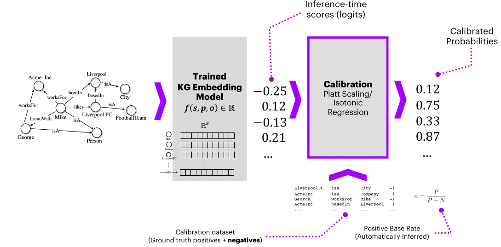

---

# Calibrazione **Senza Negativi Ground Truth** *OWA*

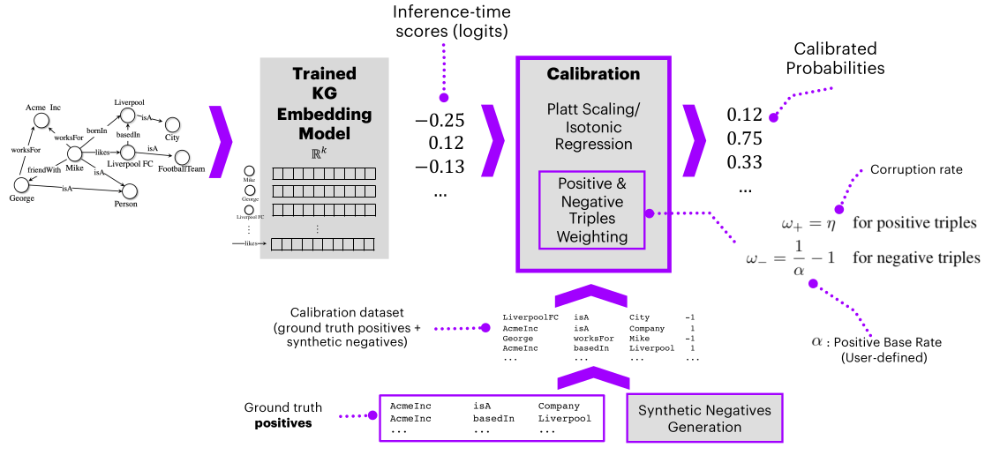

---

# Calibrazione **Efficacia**

Modelli calibrati producono risultati migliori rispetto a modelli non calibrati, producono inoltre predizioni più **affidabili** e **interpretabili**

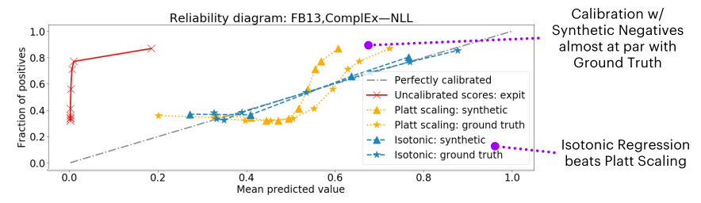

---

# KGE & Ragionamento **Neuro-Simbolico**

Iniettare conoscenza di background nei modelli tramite "**Soft Contraints**". Avendo a disposizione una ontologia, possiamo iniettare **regole** nella loss function: 

 

$$
\texttt{hasNeighbor} \equiv \texttt{hasNeighbor}^{-} \quad
\texttt{isMarriedTo} \equiv \texttt{isMarriedTo}^{-}\\
\texttt{playsFor} \equiv \texttt{isAffiliatedTo}^{-} \quad
\texttt{isConnectedTo} \equiv \texttt{isConnectedTo}^{-}
$$

 

Prendiamo in esempio regole di **equivalenza** 

--- 
*Loss Regolarizzata*: 
$$
\c{L}_\c{S}(\Theta) = \c{L}(\Theta) + \lambda\c{R}_\c{S}(\Theta)
$$

*Regolarizzazzione*: 

$$
\c{R}_\c{S}(\Theta) = \sum_{p\equiv q \in \c{A}_1} D[r_p\|r_q] + \sum_{p\equiv q^- \in \c{A}_2} D[r_p\|\Phi(r_q)]
$$

 

- $D[x\|y] = \|x-y\|_2^2$ Misura divergenza
- $\Phi$ Trasformazione dipendente dal modello
- $\c{A}_1$ Insieme assiomi **equivalenza**
- $\c{A}_2$ Insieme assiomi **inverse**

---

# KGE & Ragionamento **Neuro-Simbolico**

Andiamo quindi ad unire *rule-based models* e *KGE*, sfruttiamo sia la potenza di generalizzazione e scalabilità dei KGE, con l'interpretabilità dei modelli basati su regole.

Ulteriore metodologie sono i *Neural Theorem Provers* (NTP) che implementano il ragionamento in architetture completamente **differenziabili**

---

# **Spazi** e Metodi KGE

Spazi più complessi possono essere utilizzati per:

- Preservare **pattern relazionali** tra le entità
- Preservare **pattern strutturali** (gerarchie)
- Modellare **proprietà** desiderate, sfruttando le proprietà matematiche degli spazi

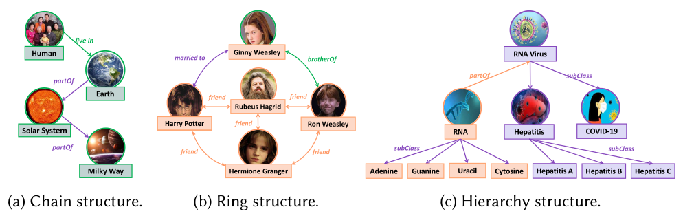

---

# **Spazi** e Metodi KGE: *Strutture Algebriche*

- *Spazi Vettoriali*: Sfruttano somma tra vettori e moltiplicazione per scalaer per proiettare entità e relazioni nello stesso spazio. Preserva le interazioni relazionali.
- *Gruppi*: Permettono di modellare proprietà come inversione e composizione
- *Anelli*: Utili nella rappresentazione con task orientatin-related, grazie alla sua superfice non orientata

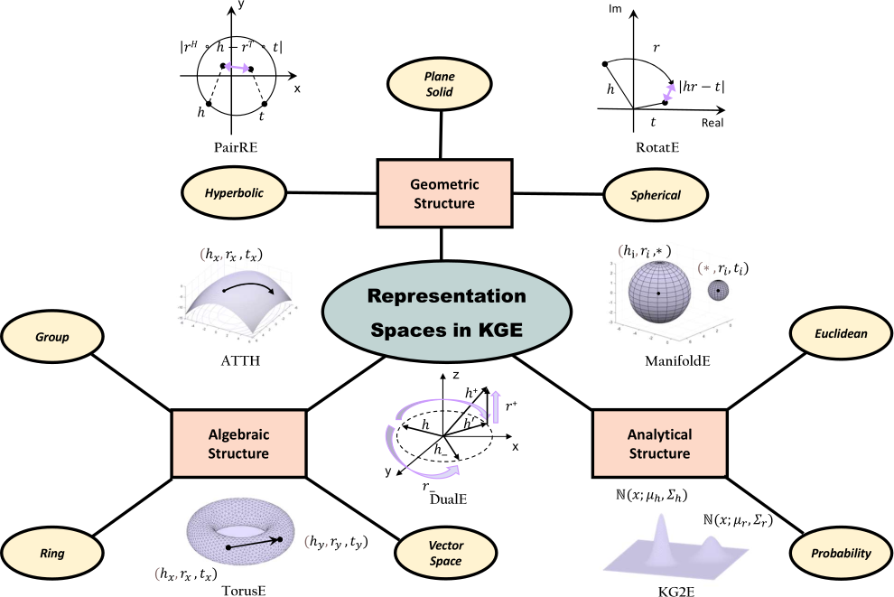

---

# **Spazi** e Metodi KGE: *Strutture Geometriche*

- *Euclidea*: Efficace rappresentazione di pattern relazionali
- *Iperbolica*: Spazi utili nel modellare strutture gerarchiche.
- *Sferica*: Eccellenti nel modellare strutture ad analle grazei alla loro natura circolare.

---

# **Spazi** e Metodi KGE: *Strutture Analitiche*

- *Probailità*: Capaci di modellare conoscenza incenerta (fuzzy)
- *Euclideo*: Facilitano l'aquisizione di rappresentazioni dinamiche e continue

---
<!-- paginate: false-->
<!-- header: "" -->

# 
 *Grazie per l'attenzione*

 Ivan Diliso, Ph.D Student, ARA

